# NeoTetris Architecture

NeoTetris is a single-file Tetris implementation (~670 lines of HTML/CSS/JS) with zero dependencies. The entire game lives in `index.html` inside an IIFE. A `requestAnimationFrame` game loop drives gravity, lock delay, line-clear animations, and rendering each frame. Game state is managed through a handful of module-scoped variables (`gameRunning`, `paused`, `gameOver`) that gate transitions between the menu, playing, paused, and game-over screens via DOM overlays.

The piece lifecycle follows a **7-bag randomizer**: pieces are drawn from a shuffled bag of all seven tetromino types, ensuring fair distribution. Each piece spawns at the top of the board, falls under gravity (with configurable soft-drop), and is subject to collision checks on every movement and rotation attempt. Wall kicks allow rotations near edges. When a piece can't move down, a 500ms lock delay starts; if it still can't move after the delay, it locks into the board grid, triggering a line-clear check and the next spawn.

```mermaid
---
title: NeoTetris — Game Architecture
---
flowchart TD

  %% ============ GAME STATES ============
  subgraph States["🎮 Game States"]
    direction LR
    MENU(["▶ Menu"])
    PLAYING["Playing"]
    PAUSED(["⏸ Paused"])
    GAMEOVER(["💀 Game Over"])

    MENU -- "Start / Restart btn" --> PLAYING
    PLAYING -- "P / Esc" --> PAUSED
    PAUSED -- "P / Esc" --> PLAYING
    PLAYING -- "Spawn fails\n(board full)" --> GAMEOVER
    GAMEOVER -- "Play Again btn" --> PLAYING
  end

  %% ============ INPUT HANDLING ============
  subgraph Input["⌨️ Input Handling"]
    direction TB
    KEYDOWN([keydown event])
    KEYUP([keyup event])

    KEYDOWN --> CHK_STATE{gameRunning\n& !gameOver?}
    CHK_STATE -- No --> IGNORE["Ignore"]
    CHK_STATE -- Yes --> CHK_PAUSE{"P / Esc?"}
    CHK_PAUSE -- Yes --> TOGGLE_PAUSE["togglePause()"]
    CHK_PAUSE -- No --> CHK_PAUSED{"paused?"}
    CHK_PAUSED -- Yes --> IGNORE
    CHK_PAUSED -- No --> ACTIONS

    subgraph ACTIONS["Key → Action Map"]
      direction LR
      LEFT["← movePiece(0,-1)"]
      RIGHT["→ movePiece(0,+1)"]
      ROT_CW["↑ rotatePiece(+1)"]
      ROT_CCW["↓ rotatePiece(-1)"]
      SOFT["Shift → softDrop=true"]
    end

    KEYUP --> SHIFT_UP["Shift release\nsoftDrop=false"]
  end

  %% ============ GAME LOOP ============
  subgraph Loop["🔄 Game Loop (requestAnimationFrame)"]
    direction TB
    RAF(["requestAnimationFrame\ncallback"])
    RAF --> IS_RUN{gameRunning?}
    IS_RUN -- No --> STOP["Return"]
    IS_RUN -- Yes --> IS_PAUSED{paused?}
    IS_PAUSED -- Yes --> STOP
    IS_PAUSED -- No --> IS_CLEARING{"clearFlashTimer\nactive?"}

    IS_CLEARING -- Yes --> FLASH_CHK{"elapsed\n> 300ms?"}
    FLASH_CHK -- No --> RENDER_CALL
    FLASH_CHK -- Yes --> FINISH_CLR["finishClear()"]
    FINISH_CLR --> RENDER_CALL

    IS_CLEARING -- No --> GRAVITY_CHK{"timestamp - lastDrop\n≥ interval?"}
    GRAVITY_CHK -- No --> RENDER_CALL
    GRAVITY_CHK -- Yes --> TRY_DROP{"movePiece(1,0)\nsucceeds?"}

    TRY_DROP -- Yes --> RESET_TIMER["Reset lastDrop\n+1 score if softDrop"]
    TRY_DROP -- No --> LOCK_CHK{"lockTimer\nstarted?"}
    LOCK_CHK -- No --> START_LOCK["lockTimer = now"]
    LOCK_CHK -- Yes --> LOCK_ELAPSED{"elapsed\n≥ 500ms?"}
    LOCK_ELAPSED -- No --> RENDER_CALL
    LOCK_ELAPSED -- Yes --> LOCK["lockPiece()"]

    RESET_TIMER --> RENDER_CALL
    START_LOCK --> RENDER_CALL
    LOCK --> RENDER_CALL

    RENDER_CALL["render()"]
  end

  %% ============ PIECE LIFECYCLE ============
  subgraph Piece["🧩 Piece Lifecycle"]
    direction TB
    BAG["7-Bag Randomizer\n(shuffled IJLOSTZ)"]
    BAG --> SPAWN["spawnPiece()\nrow=0, col=center"]
    SPAWN --> VALID_CHK{"isValid()\nat spawn pos?"}
    VALID_CHK -- No --> END_GAME["endGame()"]
    VALID_CHK -- Yes --> ACTIVE["Active Piece\n(falling)"]
    ACTIVE --> MOVE_OR_ROT["Move / Rotate\n(user input)"]
    MOVE_OR_ROT --> COLLISION{"isValid()\ncollision check"}
    COLLISION -- Pass --> ACTIVE
    COLLISION -- "Fail (rotate)" --> WALL_KICK{"Wall Kick\noffsets: 0,±1,±2"}
    WALL_KICK -- Found --> ACTIVE
    WALL_KICK -- None --> ACTIVE
    ACTIVE --> LANDED["Can't move down"]
    LANDED --> LOCK_DELAY["Lock Delay\n500ms"]
    LOCK_DELAY --> LOCK_PIECE["lockPiece()\nwrite to board"]
    LOCK_PIECE --> LINE_CHECK["checkLines()"]
    LINE_CHECK --> SPAWN
  end

  %% ============ RENDERING PIPELINE ============
  subgraph Render["🎨 Rendering Pipeline"]
    direction TB
    CLEAR_CANVAS["clearRect()\nwipe canvas"]
    CLEAR_CANVAS --> GRID["Draw grid lines\n(light strokes)"]
    GRID --> BOARD_CELLS["Draw locked cells\n(with flash anim\nfor clearing rows)"]
    BOARD_CELLS --> GHOST["Draw ghost piece\n(translucent, at\ndrop destination)"]
    GHOST --> ACTIVE_PIECE["Draw active piece\n(solid color +\nhighlight + border)"]
    ACTIVE_PIECE --> NEXT_PREVIEW["Draw next piece\n(separate canvas,\ncentered)"]
    NEXT_PREVIEW --> UI_UPDATE["Update DOM\nscore / lines / level"]
  end

  %% ============ SCORING & PROGRESSION ============
  subgraph Scoring["📊 Scoring & Progression"]
    direction TB
    LINES_CLR["Lines Cleared\n(1-4)"]
    LINES_CLR --> POINTS["Points = LINE_POINTS[n] × level\n1→100  2→300\n3→500  4→800"]
    POINTS --> TOTAL["totalLines += count"]
    TOTAL --> LVL_CALC["level = floor(totalLines/10) + 1"]
    LVL_CALC --> SPEED["dropInterval =\nmax(80, 800 - (level-1)×60) ms"]
  end

  %% ============ CROSS-SYSTEM CONNECTIONS ============
  Input -.->|"actions"| Piece
  Loop -->|"each frame"| Render
  LOCK -->|"triggers"| Piece
  LINE_CHECK -->|"lines found"| Scoring
  States -.->|"gates"| Loop
  TOGGLE_PAUSE -.-> States
  END_GAME -.-> States
```

Rendering is layered onto two `<canvas>` elements: the main board draws grid lines → locked cells (with flash animation for clearing rows) → ghost piece → active piece, while a smaller canvas previews the next piece. Scoring follows classic Tetris rules (100/300/500/800 for 1–4 lines), multiplied by the current level. Every 10 lines cleared advances the level, reducing the drop interval from 800ms down to a minimum of 80ms.

## Legend

| Shape | Meaning |
|---|---|
| **Stadium / pill** `([ ])` | Events & triggers (user input, animation frame, state labels) |
| **Rectangle** `[ ]` | Processes & actions (functions, computations) |
| **Diamond** `{ }` | Decision points (conditionals, checks) |
| **Rounded rect** `( )` | Data / state values |
| **Dotted arrows** `-.->` | Cross-system relationships |
| **Solid arrows** `-->` | Direct flow within a system |
| **Subgraphs** | Logical groupings of related systems |
