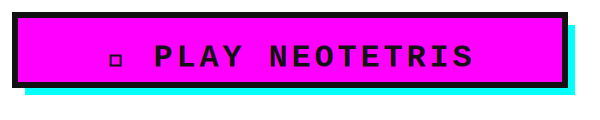

# NeoTetris

  

---

## How to Play

NeoTetris is a classic Tetris game with a bold neo-brutalist aesthetic. Tetrominoes fall from the top of the board — arrange them to complete full horizontal lines and clear them before the board fills up.

### Controls

| Key | Action |
|---|---|
| `←` / `→` | Move piece left / right |
| `↑` | Rotate clockwise |
| `↓` | Rotate counter-clockwise |
| `Shift` | Soft drop (faster fall) |
| `P` / `Esc` | Pause / Resume |

### Rules & Scoring

- Complete a horizontal line to clear it and earn points.
- Points are multiplied by your current level.
- Every 10 lines cleared advances you to the next level, increasing the fall speed.
- The game ends when a new piece cannot spawn (board is full).

| Lines Cleared | Points (× Level) |
|---|---|
| 1 | 100 |
| 2 | 300 |
| 3 | 500 |
| 4 (Tetris!) | 800 |

### Tips

- Use the **ghost piece** (translucent outline) to see exactly where your piece will land.
- Watch the **Next** preview panel to plan your moves ahead.
- Soft drop (hold `Shift`) scores +1 point per row dropped and gives you more control.
